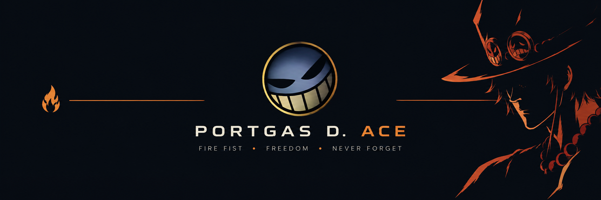

<div align="center">

<a href="https://github.com/AcengDMonk/Resolution-Master-Engine">
  
</a>

<h3>Zero-Dependency Display Pipeline Scaler & Density Invariant Engine for Android</h3>

[](https://opensource.org/licenses/MIT)
[](https://github.com/AcengDMonk/Resolution-Master-Engine)
[](https://github.com/AcengDMonk/Resolution-Master-Engine)
[](https://github.com/AcengDMonk/Resolution-Master-Engine)
[](https://github.com/AcengDMonk/Resolution-Master-Engine/releases)

<br>

<a href="#quick-start"><b>Quick Start</b></a> •
<a href="#preset-matrix"><b>Preset Matrix</b></a> •
<a href="#architecture--mechanics"><b>Architecture</b></a> •
<a href="#command-line-interface"><b>CLI Reference</b></a> •
<a href="#safety-watchdog--recovery"><b>Safety Watchdog</b></a> •
<a href="#changelog"><b>Changelog</b></a>

<br>

</div>

---

## 📌 Overview

**Resolution Master Engine (RME)** is a standalone, POSIX-compliant display scaling engine designed for Android systems. Operating at the boundary between Android's WindowManager and the SurfaceFlinger composition layer, RME performs deterministic display downscaling while mathematically enforcing native aspect ratios and physical touch-target invariants.

By shrinking the active rendering viewport, RME significantly mitigates GPU fragment shader workload, memory bandwidth saturation, and rasterization pressure—without introducing touch coordinate offsets, visual stretching, or interface clipping.

### Key Highlights
* **Zero External Dependencies:** 100% POSIX Shell. Operates out-of-the-box on standard Android environments (`toybox`/`toolbox`) without requiring `flock`, `busybox`, or custom binaries.
* **Proportional Density Preservation:** Calculates canvas density using a diagonal Euclidean formulation to ensure the physical interface size (*Smallest Width / sw*) remains identical to stock.
* **30-Second Fail-Safe Watchdog:** Background recovery daemon guarantees automatic rollback if an applied mode is unconfirmed, eliminating soft-brick and black-screen risks.
* **Aspect-Ratio Invariant Protection:** Enforces strict integer and macroblock alignment, bypassing WindowManager overscan scaling artifacts.
* **Universal Privilege Compatibility:** Fully functional under unprivileged shell environments (ADB / Shizuku / LADB) as well as privileged root shells (UID 0).

---

<a id="preset-matrix"></a>
## 📊 Preset Matrix

RME incorporates a specialized profile for modern high-resolution displays alongside an automated universal mathematical engine that computes ideal downscale metrics for any display panel geometry.

### Reference Baseline: 1080×2436 Geometry

| Profile | Render Canvas | Target DPI | Linear Scale | Pixel Load | Status | Physical UI Ratio ($sw$) |
| :--- | :---: | :---: | :---: | :---: | :---: | :--- |
| **Native** | $1080 \times 2436$ | `440` | $100.0\%$ | $2.63\text{M}$ ($0\%$) | Baseline | $\sim 392.7\text{ dp}$ (Stock) |
| **Golden** ⭐ | $\mathbf{720 \times 1624}$ | $\mathbf{293}$ | $\mathbf{66.7\%}$ | $\mathbf{1.17\text{M}}$ ($\mathbf{-55.6\%}$) | **Optimal** | $\mathbf{\sim 393.1\text{ dp}}$ (Balanced) |
| **Performance** | $756 \times 1705$ | `308` | $70.0\%$ | $1.29\text{M}$ ($-51.0\%$) | Sustained | $\sim 393.0\text{ dp}$ (Conserved) |
| **Extreme** | $540 \times 1218$ | `220` | $50.0\%$ | $0.66\text{M}$ ($-75.0\%$) | Aggressive | $\sim 392.7\text{ dp}$ (High-Efficiency) |

> 🌐 **Universal Dynamic Calculator**  
> On non-standard displays, RME dynamically parses the panel's active dimensions via WindowManager, derives the greatest common divisor ($\text{GCD}$), aligns the geometry to even macroblock boundaries, and outputs an identical 66.7% proportional ratio with matched density.

---

<a id="architecture--mechanics"></a>
## 🏗 Architecture & Mechanics

```
 [ User / CLI Execution: rme_main ]
                 │
                 ▼
 ┌──────────────────────────────┐      POSIX Atomic VFS Lock
 │    acquire_atomic_lock()     │ ─────────────────────────────┐
 └──────────────────────────────┘                              ▼
                 │                               ┌──────────────────────────┐
                 ▼                               │       State Engine       │
 ┌──────────────────────────────┐                │  /data/local/tmp/        │
 │  resolve_optimal_geometry()  │                │  raresolution/           │
 └──────────────────────────────┘                └──────────────────────────┘
                 │                                             ▲
                 ▼                                             │
 ┌──────────────────────────────┐     Spawns Guard Process     │
 │    rme_execute_preview()     │ ─────────────────────────────┘
 └──────────────────────────────┘
                 │
                 ├─► WindowManager Configuration (call_wm size & density)
                 ├─► Invariant Letterbox Bounds (cmd window set-letterbox-style)
                 ├─► Direct Viewport Compositing (call_wm scaling off)
                 └─► Hardware Composer Coupling (synchronize_vendor_hwc)
```

1. **Proportional DPI Metric:**  
   $$\text{Target DPI} = \text{round}\left(\text{Physical DPI} \times \frac{\sqrt{W_{\text{target}}^2 + H_{\text{target}}^2}}{\sqrt{W_{\text{physical}}^2 + H_{\text{physical}}^2}}\right)$$
   This geometric preservation ensures that application resource qualifiers (`layout-sw360dp`, `layout-sw392dp`) evaluate consistently, avoiding distorted layouts or massive UI scaling bugs.
2. **Direct Boundary Alignment:**  
   Calls `wm scaling off` and `cmd window scaling off` to bypass artificial compositor blits, forcing applications to render strictly within native buffer targets without resampling blur.
3. **POSIX Atomic Locking:**  
   Replaces non-portable `flock` file-descriptor locks with atomic directory creation primitives (`mkdir lock.d`), including automatic stale-PID detection to prevent deadlocks across shell instances.

---

<a id="quick-start"></a>
## 🚀 Quick Start

### 1. Installation

Android mounts `/sdcard` with the `noexec` flag. The engine must be placed in an executable system partition location such as `/data/local/tmp/`.

#### Using ADB (USB / Wireless)
```bash
adb push Resolution-Master-Engine.sh /data/local/tmp/RME.sh
adb shell chmod +x /data/local/tmp/RME.sh
```

#### On-Device (Brevent / aShell / LADB / Termux)
```bash
cp /sdcard/Download/Resolution-Master-Engine.sh /data/local/tmp/RME.sh
chmod +x /data/local/tmp/RME.sh
```

---

### 2. Standard Workflow (Safe Preview Mode)

#### Step 1: Initialize Best Preset
```bash
sh /data/local/tmp/RME.sh auto
```
The display dynamically downscales to the golden tier (e.g., $720 \times 1624$ @ 293 DPI). The engine arms the 30-second watchdog and emits a status transaction containing a verification token:

```json
{"info":"Arming Calibrated 1080x2436 Golden Baseline (720p / -55.6% Pixel Load) -> 720x1624 @ 293 DPI"}
{"ok":true,"pending":{"token":"d3b07384-d113-4f56-8a9b-891964e528b9","seconds":30}}
```

#### Step 2: Commit Transaction
Within 30 seconds, commit the change using the emitted token:
```bash
sh /data/local/tmp/RME.sh confirm d3b07384-d113-4f56-8a9b-891964e528b9
```
*If unconfirmed, the watchdog aborts and automatically restores previous state.*

---

<a id="command-line-interface"></a>
## 💻 Command-Line Interface

```bash
# Automated Presets (Protected by 30s Safety Watchdog)
sh /data/local/tmp/RME.sh auto           # Recommended balanced downscale (66.7%)
sh /data/local/tmp/RME.sh performance    # Moderate downscale (70.0%)
sh /data/local/tmp/RME.sh extreme        # Maximum pixel reduction (50.0%)

# Direct One-Shot Execution (Bypasses watchdog; ideal for automation)
sh /data/local/tmp/RME.sh instant

# Manual Target Configuration (Enforces aspect-ratio & DPI sanity)
sh /data/local/tmp/RME.sh apply <width> <height> <dpi>

# Transactional Operations
sh /data/local/tmp/RME.sh confirm <token> # Lock pending preview
sh /data/local/tmp/RME.sh revert <token>  # Immediately cancel active preview
sh /data/local/tmp/RME.sh restore         # Rollback to pre-session state

# Emergency Recovery
sh /data/local/tmp/RME.sh reset           # Factory display configuration reset
sh /data/local/tmp/RME.sh status          # Telemetry dump in structured JSON
```

---

## 🔄 7 · Hardware Composer Synchronization

When `SYNC_VENDOR_HWC=1` the engine automatically detects downstream OEM frameworks (such as Transsion XOS / HiOS) and synchronizes hardware composition targets:

```sh
settings put system tran_resolution_size_0 <WxH>
settings put system tran_resolution_size_1 <WxH>
settings put system tran_resolution_default <WxH>
setprop debug.hwc.fbsize <WxH>
```

This keeps the vendor display settings database, SystemUI, Dynamic Island, and HWC framebuffer completely aligned without UI offsets or coordinate clipping.

---

## ⚠️ 8 · Risk & DWYOR / Risiko

| Action | Level | EN Risk | ID Risiko | Safe Default |
|--------|-------|---------|-----------|:------------:|
| PREVIEW mode | 🟢 LOW | Temporary change, auto-rollback | Perubahan sementara, auto-rollback | Recommended |
| INSTANT mode | 🟡 MEDIUM | No auto-rollback | Tidak ada auto-rollback | Only for automation |
| EXTREME 50% | 🟡 MEDIUM | Very soft image, touch may feel different | Gambar sangat lembut, sentuhan terasa berbeda | Tournament only |
| Custom apply | 🟠 HIGH | Invalid ratio can cause UI issues | Rasio invalid bisa merusak UI | Keep aspect ratio |
| Permanent lock without testing | 🔴 EXTREME | Rare soft-brick on broken OEM | Soft-brick jarang pada OEM rusak | Always use PREVIEW first |

> **DWYOR** = Do With Your Own Risk  
> Always test with PREVIEW mode first.

---

## 🔄 9 · Quick Reset / Perintah Reset

```bash
# Full native restore via script
sh /data/local/tmp/RME.sh reset

# Or manual AOSP emergency commands
wm size reset
wm density reset
wm scaling auto

# Vendor framebuffer cleanup (if needed)
settings delete system tran_resolution_size_0
settings delete system tran_resolution_size_1
settings delete system tran_resolution_default
setprop debug.hwc.fbsize ""
```

---

<a id="safety-watchdog--recovery"></a>
<a id="safety-watchdog"></a>
## 🛡 Safety Watchdog & Recovery

The watchdog architecture guarantees system integrity under all operational modes:

* **Independent Lifecycle:** Spawned as an isolated background daemon via `nohup` referencing an immutable token record.
* **Auto-Revert Trigger:** If the terminal disconnects, crashes, or the user is unable to interact with the display due to an incorrect configuration, the watchdog triggers a forced rollback upon timer expiration.
* **Manual Panic Reset:** Should the script environment ever be wiped mid-transaction, stock display configuration can always be recovered directly via standard platform utilities:
  ```bash
  wm size reset && wm density reset && wm scaling auto
  ```

---

## ⚙️ Configuration (MODULE 00)

Advanced operational defaults can be directly adjusted within `MODULE 00` of the script:

```sh
# [A] Default profile executed when no parameters are provided
DEFAULT_PRESET="GOLDEN"          # GOLDEN | PERFORMANCE | EXTREME | NATIVE

# [B] Execution pipeline strategy
DEFAULT_EXEC_MODE="PREVIEW"      # PREVIEW (Guarded 30s) | INSTANT (Direct commit)

# [C] Watchdog window duration
PREVIEW_SECONDS=30

# [D] Hardware composer & display settings synchronization
SYNC_VENDOR_HWC=1                # 1 = Synchronize vendor HWC & settings | 0 = Pure AOSP only
```

---

<a id="changelog"></a>
## 📜 Changelog

### v1.1.0 (Current Stable)
* **Modular Architectural Refactoring:** Complete reverse-engineering and split into 10 decoupled subsystems (`MODULE 00` through `MODULE 09`) with standardized `rme_*` namespace protection.
* **Window Manager Alignment (`MODULE 04`):** Integrated WindowManager invariant overrides and programmatic letterbox bounds control (`--aspectRatio`, `--minAspectRatioForUnresizable`).
* **Aspect-Ratio Precision:** Real-time 6-decimal aspect-ratio derivation (`compute_aspect_ratio`) with integer bit-shift fallback for awk-deficient shells.
* **Direct Surface Compositing:** Automated orientation request locking (`set-ignore-orientation-request false`) and native overscan scaling bypass (`call_wm scaling off`).
* **POSIX VFS Atomic Locking (`MODULE 02`):** Migrated to directory creation primitives (`mkdir lock.d`) with automated stale-PID garbage collection, permanently eliminating BusyBox `flock` dependency.
* **Watchdog Concurrency Fix (`MODULE 06`):** Resolved loop race conditions, stale record evaluation, and self-locating binary resolution (`resolve_self_binary`).
* **Unified Hardware Coupling:** Replaced hardcoded vendor logic with adaptive framework synchronizer (`SYNC_VENDOR_HWC`).

### v1.0.0 (Initial Release)
* **POSIX Rewrite:** Structured as a zero-dependency, standalone shell engine.
* **Safety Watchdog:** Deployed 30-second automated rollback guard daemon.
* **Calculated Profiles:** Calibrated Golden, Performance, and Extreme resolution matrices.
* **Universal Calculator:** Engineered adaptive dynamic scaling for arbitrary panel dimensions.
* **Proportional DPI Matrix:** Developed Euclidean diagonal density matching.
* **Ratio Verification:** Integrated strict aspect ratio and minimum 30% boundary validation.
* **Vendor Decoupling:** Added unified system hooks for optional vendor database synchronization.
* **Structured Telemetry:** Implemented full runtime diagnostic reporting via JSON.

---

## 📄 License

This project is licensed under the [MIT License](LICENSE). You are free to use, inspect, modify, and integrate this software within personal setups, custom ROM distributions, or utility suites.
